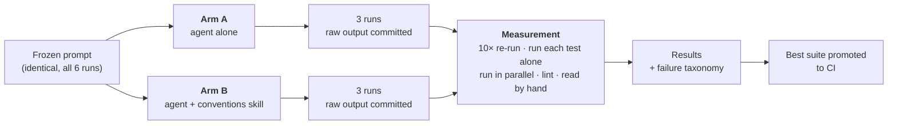

# Agent-Generated Playwright Suite

**Asked an AI agent to write an automated test suite for a web app — then I measured how good the
tests actually were, instead of assuming.**

Then I did it a second time, after giving the agent a written guide to good testing practice, to find
out whether the guide made any difference. Everything the agent produced, every measurement, and the
rules I committed to *before* running anything are published here.

**Status:** complete. 6 generation runs, 402 tests, measured 2026-08-03. The 71-test suite in
[`tests/`](tests/) runs green in CI on every push.

---

## The one-minute version

1. **The task.** Write end-to-end browser tests for [TodoMVC](https://demo.playwright.dev/todomvc)
   (a small to-do list app) using Playwright, the industry-standard browser automation framework.
2. **The twist.** A Claude Code agent wrote them, driving a real browser through the Playwright MCP
   server. I wrote the prompt, not the tests.
3. **The point.** Anyone can get an AI to emit test files. The hard question is whether they *hold
   up* — do they pass, do they randomly fail, do they use fragile shortcuts that break the next time a
   developer changes the page? So I measured all of that: I re-ran every suite 10 times, ran each test
   alone, ran them all in parallel, linted them against a fixed rule set, and read all 402 by hand.
4. **The experiment.** Half the runs got a "skill" — a written conventions guide the agent reads
   automatically. Half didn't. Same prompt, same model, same app. Only that one file differed.

**The headline finding: my automated quality score said the guide made things 10× worse. Reading the
code showed it made them 13× better.** The score was measuring something it could no longer see. That
gap — between a metric and the truth — is what this project is really about.

## How it works



The agent never sees the scoring rules. Each run happens in a stripped-down copy of the repo
containing four files — no README, no lint config, no git history. Otherwise it would be sitting the
exam with the answer key on the desk.

## Skills this project demonstrates

| Area | What I used it for |
|---|---|
| **Playwright / TypeScript** | Test architecture, page objects, fixtures, web-first assertions, parallel + sharded execution, trace capture |
| **AI agent engineering** | Claude Code in headless mode, MCP server integration, prompt design, authoring a Claude Skill and A/B testing it |
| **Test quality analysis** | Flake detection, test isolation and parallel-safety checks, brittle-selector review, a 6-category failure taxonomy |
| **Measurement & experiment design** | Pre-registered protocol frozen before data collection, one-variable comparison, controlling for machine load, false-positive analysis |
| **Static analysis** | ESLint flat config, `eslint-plugin-playwright`, a 16-rule quality gate used as a measuring instrument |
| **CI/CD** | GitHub Actions running the suite and lint on every push, with report artifacts |
| **Engineering judgement** | Publishing a result that contradicted my own metric, and a repair stage that honestly reported 0% |

## Terms, in plain English

- **Flake** — a test that passes sometimes and fails other times without the app changing. The most
  expensive failure mode in test automation, because it destroys trust in the whole suite.
- **Isolation** — each test must pass on its own, not only when the ones before it happen to run first.
- **Brittle selector** — finding a button by its CSS styling instead of its meaning. It works today and
  breaks the moment someone redesigns the page.
- **Arm A / Arm B** — the two halves of the experiment: without the conventions guide, and with it.

---

## The result

Two convention metrics disagree about which arm is better, and the automated one is wrong.

| | Arm A (no skill) | Arm B (skill) |
|---|---|---|
| Tests generated | 66 / 61 / 66 | 71 / 74 / 64 |
| First-run pass rate | 100% / 100% / 100% | 100% / 100% / 100% |
| Flake rate over 10 runs | 0% / 0% / 0% | 0% / 1.4% / 0% |
| Isolation failures | 0 / 0 / 0 | 0 / 0 / 0 |
| Parallel failures (workers=4) | 0 / 1 / 0 | 0 / 0 / 0 |
| **Gate violations, raw** | 0 / 6 / 1 — **7 total** | 28 / 16 / 31 — **75 total** |
| **Brittle selectors, confirmed by hand** | 0 / 11 / 2 — **13 total** | 0 / 0 / 1 — **1 total** |
| Cost per run | $2.64 / $2.01 / $4.87 | $3.71 / $2.96 / $2.45 |
| Turns | 44 / 32 / 115 | 78 / 46 / 38 |

Read the automated row and the skill made things ten times worse. Read the hand-confirmed row and it
made them thirteen times better.

### Why they disagree

**All 75 of arm B's gate violations are false positives, and the skill caused them by working.** It
instructs the agent to put assertion helpers on the page object. Arm B did. `expect-expect` only
recognises `expect` called directly in a test body, so every assertion delegated to a helper reads as
a test with no assertions:

```ts
async expectVisibleTodos(titles: string[]): Promise<void> {
  await expect(this.titles).toHaveText(titles);   // real, awaited, invisible to the rule
}
```

The generalisable point: **an automated rubric measures what it can parse, and an intervention that
changes code structure can move the code outside what the rubric parses.** The failure is silent. The
numbers stay plausible; they just point the wrong way. Only reading the code caught it.

### What the skill actually did

**It raised the floor, not the ceiling.** Arm A's best run was already clean, cheap and well
structured — there was nothing for a skill to improve. What disappeared was arm A's *bad day*.

| Per-run spread | Arm A | Arm B |
|---|---|---|
| Raw locator hits | 1, 12, 3 | 3, 3, 3 |
| Cost | $2.01 – $4.87 | $2.45 – $3.71 |
| Turns | 32 – 115 | 38 – 78 |

Arm A used CSS class selectors for structural elements eleven times in one run (`.main`, `.footer`,
`.filters`, `li.editing`); arm B used one across all three runs. Every other raw locator in arm B is a
markup-injection check like `locator('script')`, which is correct usage — there is no role for "a tag
that should not exist". All three arm B runs produced a `pages/` directory and a Playwright fixture;
no arm A run created a fixture at all.

**Averages hide this almost perfectly.** Mean cost moved 4%, mean test count 8%, mean pass rate not at
all. An A/B judged on means alone would have concluded the skill does nothing.

### What it changed nothing about

First-run pass rate was 100% in all six runs. Isolation and parallel behaviour were clean in both arms.
Flake was indistinguishable from zero once both arms were measured under matched conditions. And **no
hard wait appeared in any of the 402 tests** — the failure mode this project was built to catalogue
never occurred, so the skill's rule against it had nothing to prevent.

---

## Method

Full pre-registered protocol: [`docs/protocol.md`](docs/protocol.md), frozen before the first run.

- **Target:** [`demo.playwright.dev/todomvc`](https://demo.playwright.dev/todomvc) — Playwright's own
  demo app, static and known-good, so a failing test means the *test* is wrong.
- **One variable.** `gen-base-b` is `gen-base-a` plus a single file, the skill. Same frozen
  [prompt](prompts/task.txt), same pinned model (`claude-opus-5`), fresh session per run.
- **The agent cannot read the rubric.** Each run happens in a `git archive` export holding only four
  harness files — no README, no `CLAUDE.md` (which Claude Code loads automatically), no ESLint config,
  no git history. Otherwise the agent would know it was being measured and could read the exact rules
  it was about to be scored against.
- **Three runs per arm**, all raw output committed untouched before being read.
- **Retries are 0 everywhere, including CI**, because retries hide the flake being measured.

**Both arms were re-measured back to back, interleaved A/B/A/B/A/B.** Arm A was first measured while
the machine was thrashing on 16 GB of swap, and its one flaky test was a navigation timeout. Comparing
that against arm B on a quiet machine would have credited the skill for a closed browser. Under
matched conditions arm A's flake disappeared. Conditions are recorded in
[`metrics/conditions.md`](metrics/conditions.md).

## Honesty notes

- **Neither arm needed repairs.** Both `repaired/` directories are byte-identical to their raw output
  and both `REPAIRS.md` files record 0%. Inventing edits to justify the stage would have corrupted the
  metric the stage exists to produce.
- **Arm B's repair criterion was unsatisfiable as written**, requiring zero gate violations when all
  28 were false positives. Satisfying it literally meant deleting a good abstraction to please a rule
  that is wrong about it. Both readings are published in
  [`arms/b-skill/repaired/REPAIRS.md`](arms/b-skill/repaired/REPAIRS.md).
- **Arm B run 1 took four attempts.** One died on an API transport error; two were killed by the OS on
  a machine out of RAM and swap. None reached the point of writing tests. The aborted transcript is
  committed rather than dropped — retrying until output appears is exactly what makes an A/B
  untrustworthy.
- **CI lints with a corrected config** ([`eslint.ci.mjs`](eslint.ci.mjs)). `eslint.config.mjs` stays
  frozen because metric 6 is defined as the hits it produces.
- n = 3 per arm, one app, one model, one prompt, one day. This measures what this agent did here, not
  agent-generated tests in general.

## Layout

| Path | What it holds |
|---|---|
| `docs/protocol.md` | Pre-registered protocol, frozen before generation |
| `docs/failure-taxonomy.md` | The full analysis, with quoted snippets |
| `docs/mcp-notes.md` | What `@playwright/mcp@0.0.78` actually does, verified not assumed |
| `prompts/task.txt` | The frozen prompt, byte-identical for all six runs |
| `arms/a-baseline/`, `arms/b-skill/` | Raw output per run, untouched, plus repair logs |
| `logs/` | Full session transcript for every run, including the aborted one |
| `metrics/` | Every measurement — the source of every number above |
| `.claude/skills/playwright-conventions/` | The skill under test |
| `tests/` | The shipped suite (promoted arm B run 1, 71 tests) |

## Reproduce

```bash
npm ci && npx playwright install chromium
npm test                                              # the shipped suite
node scripts/measure.mjs arms/a-baseline/run-1 /tmp/out --runs 10
node scripts/lint-suite.mjs arms/a-baseline/run-1 /tmp/out
scripts/generate-arm.sh a 4                           # a fresh generation run
```

**Built with:** Playwright 1.62 · TypeScript 6 · Claude Code (`claude-opus-5`) ·
`@playwright/mcp` 0.0.78 · ESLint 10 + `eslint-plugin-playwright` · GitHub Actions
